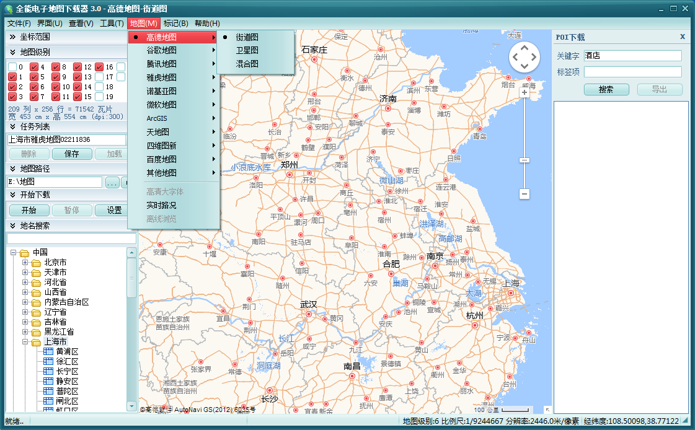
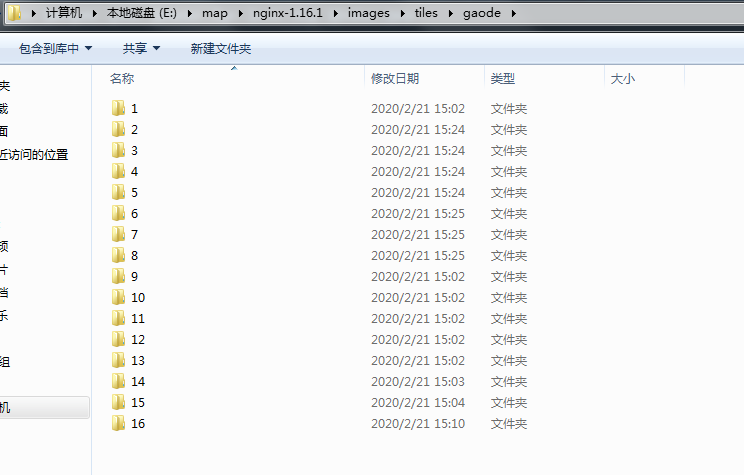
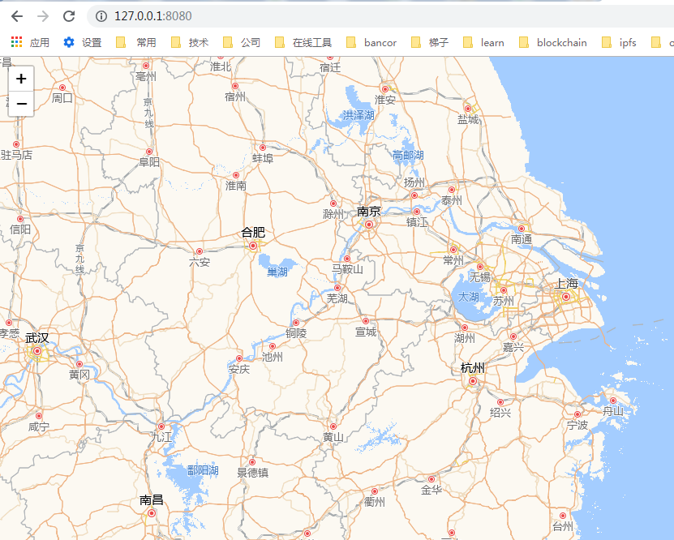

## 使用ngnix部署百度/高德等离线地图瓦片服务器


### 下载地图瓦片
使用全能地图下载器下载地图瓦片


### 配置ngnix

修改ngnix的配置文件

```
worker_processes  1;

events {
    worker_connections  1024;
}

http {
    include       mime.types;
    default_type  application/octet-stream;
    sendfile        on;
    keepalive_timeout  65;

    server {
        listen       8080;
        server_name  localhost;

        location / {
            root   html;
            index  index.html index.htm;
        }
        
         location /tiles/ {
               root "E:/map/nginx-1.16.1/images";
         }
    }
}
```

目录E:/map/nginx-1.16.1/images是存放地图的瓦片，注意下面还有几级目录。




修改nginx默认的首页

对于百度地图使用

```
<!DOCTYPE html>
<html xmlns="http://www.w3.org/1999/xhtml">
<head>
<meta http-equiv="Content-Type" content="text/html; charset=utf-8"/>
    <title></title>
    <link rel="stylesheet" href="https://openlayers.org/en/v5.3.0/css/ol.css" type="text/css">
    <style type="text/css">
        body, #mainMap {
            border: 0px;
            margin: 0px;
            padding: 0px;
            width: 100%;
            height: 100%;
            font-size: 13px;
        }
    </style>
    <script src="https://openlayers.org/en/v5.3.0/build/ol.js" type="text/javascript"></script>
 
</head>
<body>
 
    <div id="mainMap">
 
    </div>
 
</body>
</html>

<script type="text/javascript">
    var projection = ol.proj.get("EPSG:3857");
    var resolutions = [];
    for (var i = 0; i < 19; i++) {
        resolutions[i] = Math.pow(2, 18 - i);
    }
    var tilegrid = new ol.tilegrid.TileGrid({
        origin: [0, 0],
        resolutions: resolutions
    });
 
    var baidu_source = new ol.source.TileImage({
        projection: projection,
        tileGrid: tilegrid,
        tileUrlFunction: function (tileCoord, pixelRatio, proj) {
            if (!tileCoord) {
                return "";
            }
            var z = tileCoord[0];
            var x = tileCoord[1];
            var y = tileCoord[2];
 
            if (x < 0) {
              //  x = "M" + (-x);
            }
            if (y < 0) {
             //   y = "M" + (-y);
            }
 
            return " /tiles/baidu/"+ z + "/" + x + "/" + y + ".png"
            
          
        }
    });
 
    var baidu_layer = new ol.layer.Tile({
        source: baidu_source
    });
 
    var map = new ol.Map({
        target: 'mainMap',
        controls: ol.control.defaults().extend([
               new ol.control.MousePosition({ projection: 'EPSG:4326' })
        ]),
        layers: [baidu_layer],
        view: new ol.View({
            center: ol.proj.transform([104.06, 30.67], 'EPSG:4326', 'EPSG:3857'),
            zoom: 4
        })
    });
</script>
```

对于高德和谷歌地图使用

```

<!DOCTYPE html>
<html>
    <head>
        <title>Custom Tile Server</title>

        <meta charset="utf-8" />
        <meta name="viewport" content="width=device-width, initial-scale=1.0">

        <link rel="stylesheet" href="https://unpkg.com/leaflet@1.3.1/dist/leaflet.css" integrity="sha512-Rksm5RenBEKSKFjgI3a41vrjkw4EVPlJ3+OiI65vTjIdo9brlAacEuKOiQ5OFh7cOI1bkDwLqdLw3Zg0cRJAAQ==" crossorigin=""/>
        <script src="https://unpkg.com/leaflet@1.3.1/dist/leaflet.js" integrity="sha512-/Nsx9X4HebavoBvEBuyp3I7od5tA0UzAxs+j83KgC8PU0kgB4XiK4Lfe4y4cgBtaRJQEIFCW+oC506aPT2L1zw==" crossorigin=""></script>

        <style>
            html, body, #map {
                width: 100%;
                height: 100%;
                margin: 0;
                padding: 0;
            }
        </style>
    </head>

    <body>
        <div id="map"></div>

        <script>
            var map = L.map('map').setView([0, 0], 3);

            L.tileLayer('tiles/gaode/{z}/{x}/{y}.png', {
                maxZoom: 16,
                attribution: 'Map data &copy; <a href="https://www.openstreetmap.org/">OpenStreetMap</a> contributors, <a href="https://creativecommons.org/licenses/by-sa/2.0/">CC-BY-SA</a>',
                id: 'base'
            }).addTo(map);
        </script>
    </body>
</html>

```

## 验证
打开 http://127.0.0.1:8080

瓦片的地址

百度地图
http://127.0.0.1:8080/tiles/baidu/{z}/{x}/{y}.png

高德地图
http://127.0.0.1:8080/tiles/gaode/{z}/{x}/{y}.png




